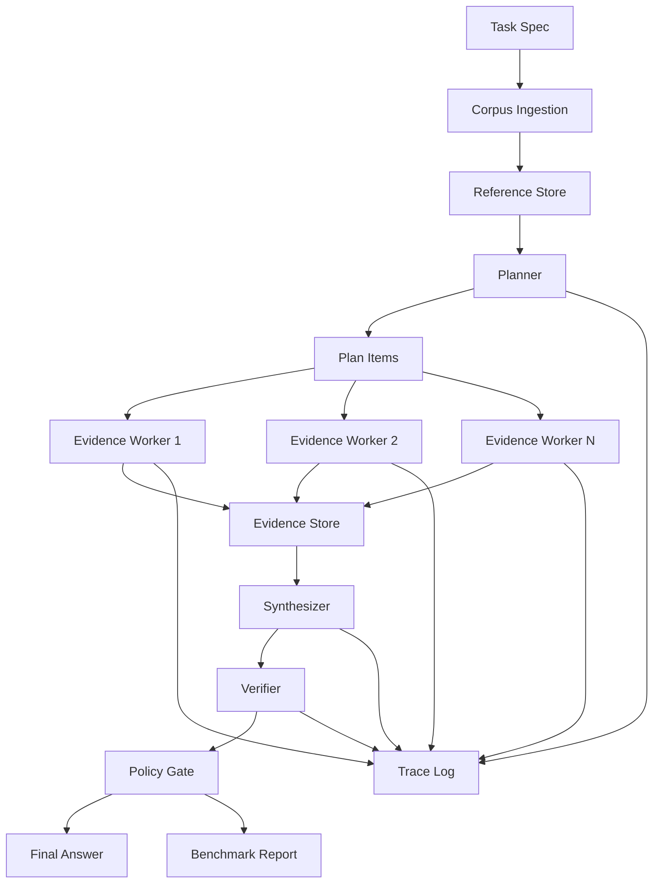

# Phase 6: Tests, README, Architecture Docs

**Project:** `~/src/recursive-execution-harness-lab`
**Context:** ALL implementation modules exist and import cleanly. Now add tests, README, and docs.
**Read AGENTS.md first.**

---

## Part 1: Tests (`tests/`)

Create pytest tests for all modules. EVERY test uses MockProvider — NO real API calls.

### `tests/__init__.py`
Empty file.

### `tests/conftest.py`
```python
from __future__ import annotations

from pathlib import Path
from tempfile import TemporaryDirectory

import pytest
import yaml

from rxh.models import (
    DocumentRef,
    EvidenceCard,
    Plan,
    PlanItem,
    TaskSpec,
)
from rxh.providers import MockProvider


@pytest.fixture
def sample_task() -> TaskSpec:
    return TaskSpec(
        id="test_task",
        title="Test Task",
        question="What is the answer?",
        success_criteria=["Use sources properly"],
        constraints=["No speculation"],
        evaluation_questions=["Are claims supported?"],
    )


@pytest.fixture
def sample_docs() -> list[DocumentRef]:
    return [
        DocumentRef(
            id="doc_0001",
            source_path="/fake/doc1.md",
            title="Document One",
            content_hash="abc123",
            char_count=200,
        ),
        DocumentRef(
            id="doc_0002",
            source_path="/fake/doc2.md",
            title="Document Two",
            content_hash="def456",
            char_count=300,
        ),
    ]


@pytest.fixture
def tmp_corpus():
    """Create a temporary corpus directory with .md files."""
    with TemporaryDirectory() as tmpdir:
        corpus = Path(tmpdir) / "corpus"
        corpus.mkdir()
        (corpus / "doc1.md").write_text("# Doc 1\n\nContent of document one.", encoding="utf-8")
        (corpus / "doc2.txt").write_text("Content of document two.", encoding="utf-8")
        (corpus / "skip.pdf").write_text("fake pdf", encoding="utf-8")
        yield corpus
```

### `tests/test_models.py`
Test all Pydantic models serialize and deserialize correctly:
- TaskSpec round-trip
- DocumentRef round-trip
- EvidenceCard round-trip with default_factory
- PlanItem with assigned_refs
- Plan with nested PlanItems
- WorkerResult with nested EvidenceCards
- ClaimCheck with optional issue
- VerificationResult with verdict enum
- TraceEvent with default_factory fields
- RunMetrics with default values

### `tests/test_providers.py`
- MockProvider returns responses in order
- MockProvider tracks calls
- OpenAICompatibleProvider.__init__ reads env vars (mock with monkeypatch)

### `tests/test_json_utils.py`
- extract_json_object extracts valid JSON
- extract_json_object handles surrounding text
- extract_json_object raises ValueError on no JSON
- extract_json_object handles nested objects

### `tests/test_ingest.py`
- ingest_corpus reads only .md and .txt files
- ingest_corpus assigns sequential IDs
- ingest_corpus computes correct char_count and hash
- ingest_corpus writes JSONL output
- load_documents_jsonl reads JSONL back (use tmp_path fixture)

### `tests/test_trace.py`
- TraceWriter creates directory
- TraceWriter.emit writes valid JSONL
- TraceWriter.emit returns TraceEvent
- Multiple emits produce one line each

### `tests/test_planner.py`
- plan_prompt includes task question and document metadata
- create_plan calls provider, parses JSON, returns Plan (use MockProvider with valid plan JSON)
- create_plan writes plan.json
- create_plan emits trace events

### `tests/test_worker.py`
- worker_prompt includes subquestion and document text
- run_worker calls provider, parses JSON, returns WorkerResult with evidence cards
- run_worker handles missing documents (docs_by_id missing a ref)
- run_worker emits trace events

### `tests/test_synthesizer.py`
- synthesis_prompt includes evidence cards
- synthesize_answer calls provider, writes final_answer.md
- synthesize_answer emits trace events

### `tests/test_verifier.py`
- verification_prompt includes final answer and evidence cards
- verify_answer returns VerificationResult with verdict
- verify_answer writes verification.json
- verify_answer detects unsupported claims in mock response

### `tests/test_long_context.py`
- build_long_context_prompt stays within max_chars
- build_long_context_prompt includes task question
- run_long_context calls provider and writes final_answer.md

### `tests/test_recursive.py`
- run_recursive with 2-item plan calls planner, 2 workers, synthesizer, verifier
- run_recursive writes plan.json, worker_results.jsonl, evidence_cards.jsonl, final_answer.md, verification.json
- Uses MockProvider with pre-set responses for all 4 LLM calls (planner, worker1, worker2, synthesizer, verifier)

### `tests/test_compare.py`
- compare_runs handles missing verification.json
- compare_runs handles missing evidence_cards.jsonl
- compare_runs produces markdown report

---

## Part 2: README.md

Write at repo root. Sections:
1. **Research Question** — the thesis
2. **Architecture** — Mermaid diagram (see below)
3. **Quickstart** — install, run baseline, run recursive, compare
4. **Project Structure** — file tree
5. **Limitations and Threats to Validity** — 7 points from spec
6. **Research Contribution Statement** — quote from spec section 78
7. **License** — MIT

Mermaid diagram:


---

## Part 3: `docs/ARCHITECTURE.md`

Sections:
1. Architecture diagram (same Mermaid)
2. Component descriptions (planner, worker, synthesizer, verifier, trace)
3. Data flow (corpus → refs → plan → workers → evidence → synthesis → verification)
4. Trace model (JSONL events, required events per mode)
5. Comparison diagram (long-context vs recursive Mermaid)
6. Future roadmap (Temporal, OpenTelemetry, AutoHarness integration)

---

## Acceptance Criteria

```bash
cd ~/src/recursive-execution-harness-lab

# Lint
uv run ruff check tests/ src/rxh/
uv run ruff format tests/ src/rxh/

# All tests pass with MockProvider (no API calls!)
uv run pytest tests/ -v --tb=short

# All files exist
test -f README.md && echo "README exists"
test -f docs/ARCHITECTURE.md && echo "ARCHITECTURE exists"
```

Tests must pass. If any fail, fix them. MockProvider responses must be valid JSON for planner/worker/verifier tests.
