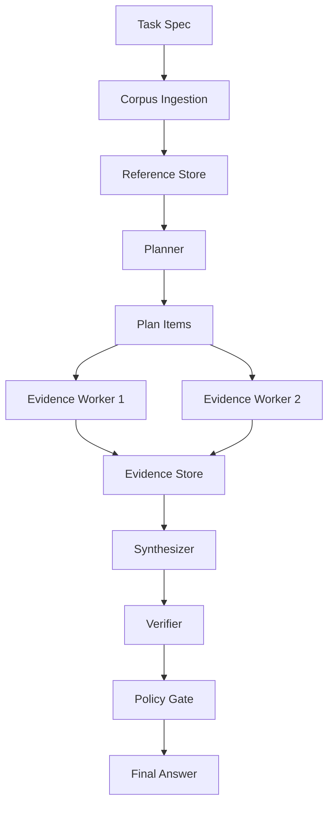

# Recursive Execution Harness Lab <small>(Puff)</small>

A research harness for comparing long-context agent execution against recursive, reference-based execution on multi-document research synthesis tasks.

## Research Question

When does recursive, reference-based execution outperform naive long-context prompting for long-running agent tasks?

## Architecture



## Quickstart

```bash
# Install
git clone https://github.com/rmax-ai/recursive-execution-harness-lab
cd recursive-execution-harness-lab
uv sync --extra dev

# Run baseline
rxh run --task benchmarks/research_synthesis/tasks/recursive_execution.yaml \
  --corpus benchmarks/research_synthesis/corpora/sample \
  --mode long-context --model gpt-5.5-thinking --out runs/baseline

# Run recursive
rxh run --task benchmarks/research_synthesis/tasks/recursive_execution.yaml \
  --corpus benchmarks/research_synthesis/corpora/sample \
  --mode recursive --model gpt-5.5-thinking --out runs/recursive

# Compare
rxh compare runs/baseline runs/recursive

# Run tests
uv run pytest tests/ -v
```

## Project Structure

```text
src/rxh/          — core package
benchmarks/       — task specs and sample corpora
tests/            — pytest tests (MockProvider only)
docs/             — architecture docs
```

## Limitations and Threats to Validity

1. The verifier is model-based and may share blind spots with the generator.
2. The corpus may favor one architecture over another.
3. Recursive execution uses more explicit scaffolding, which may improve prompt clarity independently of architecture.
4. The baseline may be disadvantaged if context limits force document truncation.
5. Results from research synthesis may not generalize to coding, customer support, or enterprise workflows.
6. Token cost may vary by provider and caching strategy.
7. Better long-context models may reduce the observed gap.

## Research Contribution Statement

This project does not propose a new foundation model or a new agent framework.
It proposes a measurement harness for an architectural question:
When should long-running agents rely on larger context, and when should they
externalize state into recursive execution, evidence stores, and verification gates?

## License

MIT

