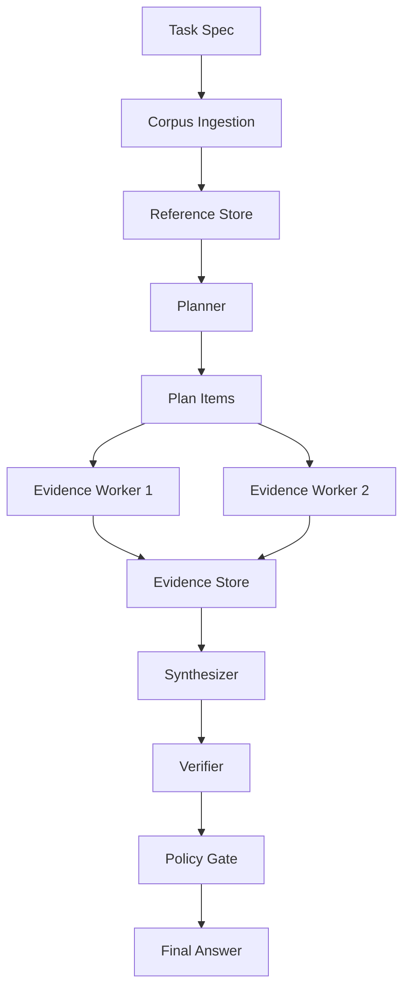
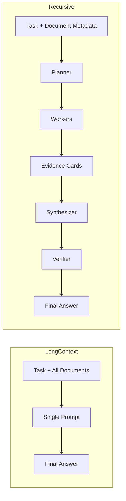

# Architecture

## 1. Architecture Overview

The harness compares two execution styles for the same research task: a single long-context prompt and a recursive workflow that externalizes intermediate state into plans, evidence cards, and verification results.

## 2. Component Descriptions

### Planner

The planner receives the task plus document metadata and produces bounded `PlanItem` entries with assigned document references. It does not answer the task.

### Worker

Each worker receives one plan item plus the full text of its assigned documents. It emits `EvidenceCard` objects and records open questions or failures without raising execution errors for missing refs.

### Synthesizer

The synthesizer consumes the task, the plan strategy, and the evidence store. It writes `final_answer.md` and is instructed to cite evidence IDs inline.

### Verifier

The verifier is a separate model call. It checks the final answer against the evidence store and writes `verification.json` with verdict, claim checks, unsupported claims, and attribution issues.

### Trace

The trace writer emits one `TraceEvent` per line in JSONL. It captures stage transitions, token usage for model calls, and the refs that move through the workflow.

## 3. Data Flow

The recursive path is:

`corpus -> refs -> plan -> workers -> evidence -> synthesis -> verification`

The baseline path is:

`corpus -> refs -> long-context prompt -> final answer`

Both modes write filesystem artifacts so runs can be inspected and compared after execution.

## 4. Mode Comparison

Long-context execution minimizes orchestration but can be limited by prompt budget and implicit reasoning state. Recursive execution adds explicit scaffolding and intermediate artifacts, which improves inspectability and may improve reliability at the cost of additional calls.

## 5. Trace Model

Trace files use JSONL: one serialized `TraceEvent` per line.

Each event includes:

- `run_id`
- `event_id`
- `timestamp`
- `stage`
- `event_type`
- `actor`
- `input_refs`
- `output_refs`
- `token_usage`
- `metadata`

Required events by mode:

- Both modes: `run_started`, `run_completed`
- Recursive mode: `planning_started`, `planning_completed`, `worker_started`, `worker_completed`, `synthesis_started`, `synthesis_completed`, `verification_started`, `verification_completed`

Events that touch documents, plans, or evidence should include `input_refs` and `output_refs`. Every LLM completion event should include `token_usage`.
