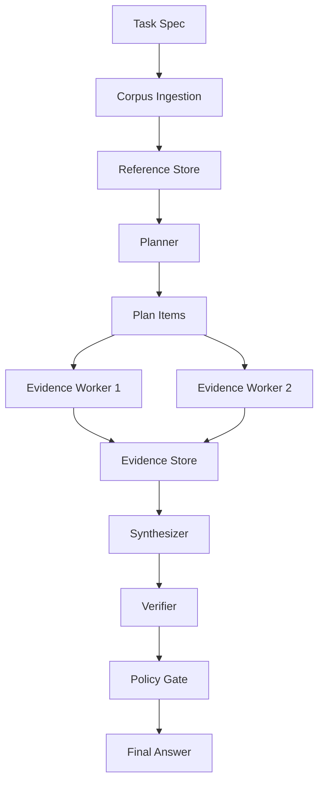

# Recursive Execution Harness Lab

A research harness comparing how AI agents perform on long-running tasks — specifically, whether recursive, reference-based execution outperforms the common "stuff everything into context" approach.

## The Question

> When does recursive, reference-based execution outperform naive long-context prompting for long-running agent tasks?

## The Experiment

Two execution modes, same task, same corpus:

| Mode | Approach |
|------|----------|
| **Long-context** | Concatenate all documents into one giant prompt, ask the model to answer |
| **Recursive** | Ingest into reference store → planner decomposes → bounded workers extract evidence → synthesizer writes from evidence cards → verifier checks every claim |

## Architecture



## Quickstart

```bash
git clone https://github.com/rmax-ai/recursive-execution-harness-lab
cd recursive-execution-harness-lab
uv sync --extra dev

# Run baseline (long-context)
rxh run --task benchmarks/research_synthesis/tasks/recursive_execution.yaml \
  --corpus benchmarks/research_synthesis/corpora/sample \
  --mode long-context --model gpt-5.5-thinking --out runs/baseline

# Run recursive harness
rxh run --task benchmarks/research_synthesis/tasks/recursive_execution.yaml \
  --corpus benchmarks/research_synthesis/corpora/sample \
  --mode recursive --model gpt-5.5-thinking --out runs/recursive

# Compare
rxh compare runs/baseline runs/recursive

# Run tests
uv run pytest tests/ -v
```

## Key Metrics

- **Claim support rate** — how many claims in the final answer are backed by evidence
- **Unsupported claim count** — claims the verifier flags as lacking evidence
- **Source attribution errors** — citations that don't match actual sources
- **Evidence coverage** — what fraction of relevant sources are actually cited
- **Token usage** — total input + output tokens across all LLM calls
- **Trace completeness** — does the run record every required event?

## Primary Benchmark

**Multi-document research synthesis**: given a corpus of 8 documents about long-running agents, context rot, recursive execution, durable workflows, and policy-as-code, write a technical synthesis with claims, evidence, counterarguments, and references.

## Limitations

1. The verifier is model-based and may share blind spots with the generator
2. The corpus may favor one architecture over another
3. Recursive execution uses more explicit scaffolding — prompt clarity may improve independently of architecture
4. Results from research synthesis may not generalize to coding or enterprise workflows
5. Better long-context models may reduce the observed gap

## Research Contribution

> This project does not propose a new foundation model or a new agent framework. It proposes a measurement harness for an architectural question: when should long-running agents rely on larger context, and when should they externalize state into recursive execution, evidence stores, and verification gates?

## Docs

- [Architecture](ARCHITECTURE.md) — component descriptions, data flow, trace model
- [GitHub Repository](https://github.com/rmax-ai/recursive-execution-harness-lab) — source code, issues, contributions

---

[Recursive Execution Harness Lab](https://github.com/rmax-ai/recursive-execution-harness-lab) · MIT License · v0.1.0
